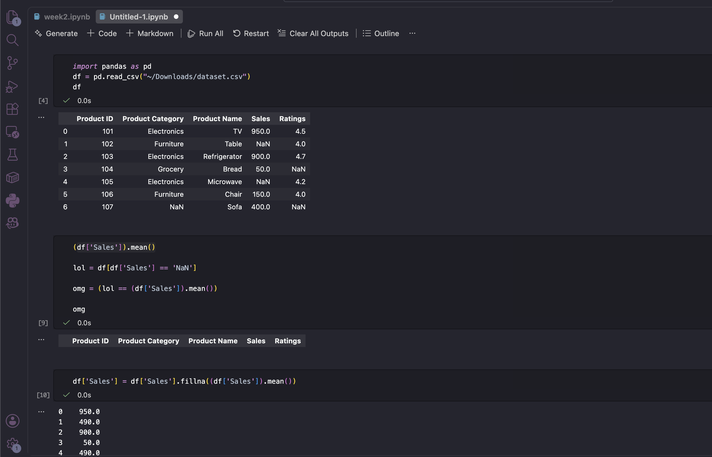
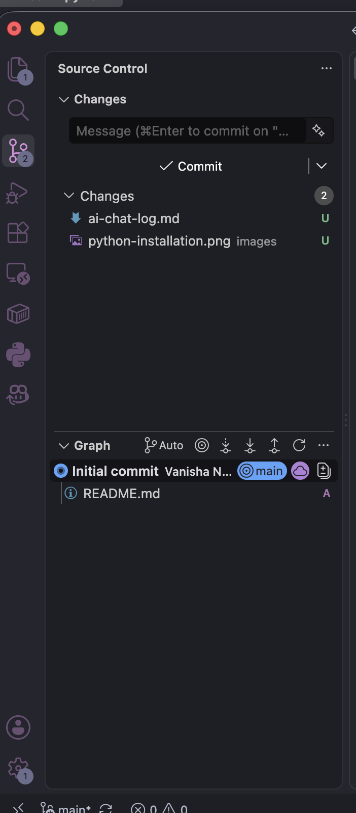
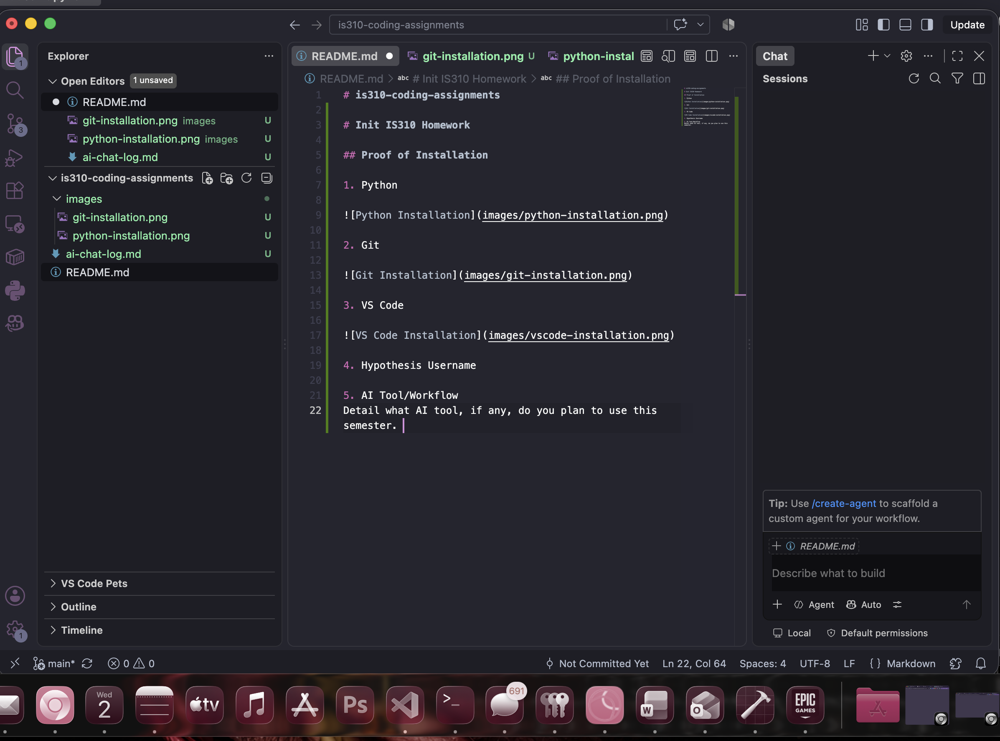

# is310-coding-assignments

# Init IS310 Homework

## Proof of Installation

1. Python

2. Git

3. VS Code

4. Hypothesis Username: vnara3

5. AI Tool/Workflow
I have Copilot installed and connected to my VS code so i can use this if i get stuch and need help on anything
